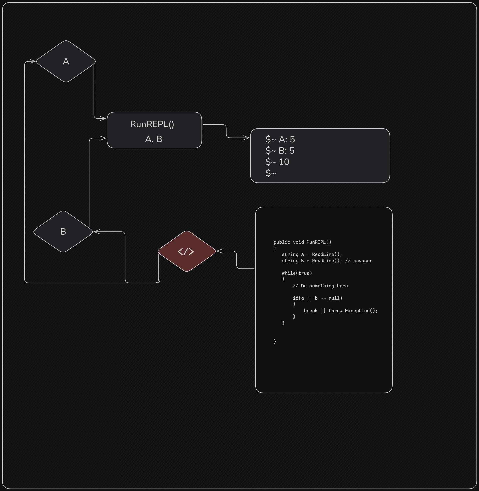

# Flowchart basic Interpreter

# Flow
    Steps:
        - Run continuesly utilizing a infinite loop
        - Take in CommandLine arguments by passing the method the string[] args paramater
        - Evaluate simple numerical input (Currently supported)
        - Print back string statements

